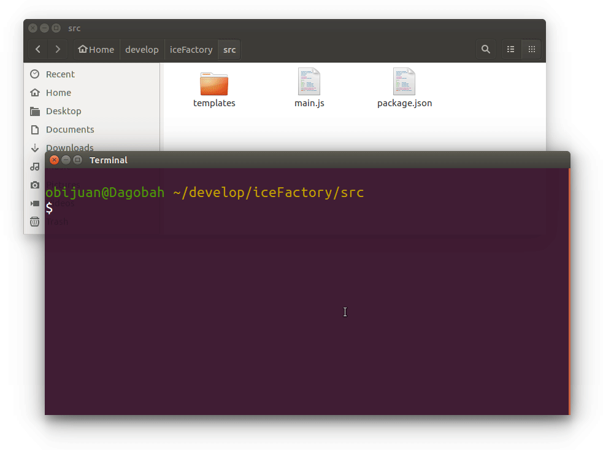

# iceFactory
A Javascript library for generating blocks for the ICEstudio FPGA development  environment

## Table generator

Try the [Table generator](https://obijuan.github.io/iceFactory/src/icetable.html). Generate the blocks for combinational circuits of N inputs and M outputs


# LOG

## 2018-July-2: Initial test


* Edit the **main.js** file
* **Change** the **N** and **M** parameters (Number of inputs and outpus of the table)
* Execute:

```bash
node main.js
```

 The **icestudio block** with the table will be generated. You can open it in Icestudio, for modifiying or you can include directly as a block for using it in your projects



